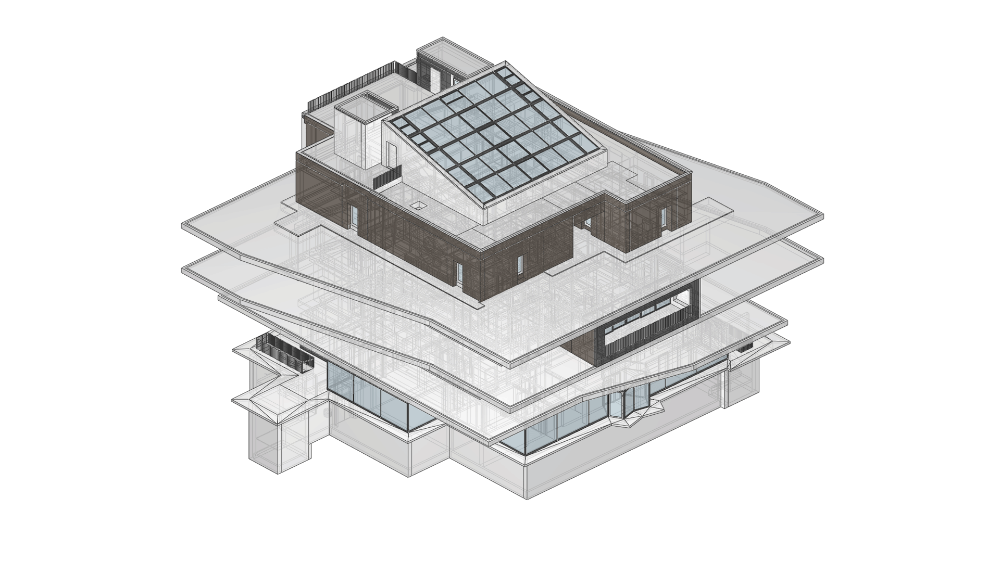

# COMPAS IFC



[](https://doi.org/10.5281/zenodo.21335442)

A front-end data model for the [Industry Foundation Classes (IFC)](https://www.buildingsmart.org/standards/bsi-standards/industry-foundation-classes/),
the open BIM exchange standard maintained by buildingSMART International.
COMPAS IFC sits between IFC's full schema and the people who need to work with
it, exposing a small, intentional API where the schema offers thousands of
classes and dozens of relationship patterns.

The toolkit is the open-source artefact described in chapter 4 of *Future Data
Models for AEC: From Simplicity for Humans to Interoperability by AI* (Li Chen,
ETH Zürich, 2026). It targets researchers and developers who need to read,
analyse, modify, and write IFC data without becoming experts in the schema
itself.

## What it does

* Opens any IFC file (IFC2X3, IFC4, or IFC4X3) and exposes its content through
  one container class and one element class.
* Materialises the spatial hierarchy as an explicit
  [tree](https://compas.dev/compas/latest/api/generated/compas.datastructures.Tree.html)
  with direct parent/child pointers, so traversal does not require chasing
  `IfcRelContainedInSpatialStructure` instances.
* Materialises non-hierarchical relationships (structural connections, system
  flows, material associations, geometric dependencies) as a separate graph.
* Couples geometric representations to executable kernels — the COMPAS core
  library for primitives and meshes, and OpenCascade (via
  [compas_occ](https://github.com/compas-dev/compas_occ)) for B-Rep and
  NURBS — so volumes, surface areas, and bounding boxes can be computed
  without leaving Python. Contact and collision detection between elements
  is handled with a NumPy + [Shapely](https://shapely.readthedocs.io/)
  broadphase/narrowphase.
* Treats every product subclass uniformly through a single `GenericElement`
  type, falling back to `IfcBuildingElementProxy` (with the original type name
  preserved as `ObjectType`) for custom or domain-specific elements.
* Validates element metadata against
  [Pydantic](https://docs.pydantic.dev/) schemas and rejects non-conforming
  data at the point of insertion.

## Architecture (three layers)

```
┌───────────────────────────────────────────────────────────────────┐
│ Front-end API                                                     │
│   BuildingInformationModel  GenericElement                        │
│   SpatialTree (model.tree)  InteractionGraph (model.graph)        │
└───────────────────────────────────────────────────────────────────┘
                                 ▲
┌───────────────────────────────────────────────────────────────────┐
│ Bidirectional mapping layer                                       │
│   relationship resolution · placement-chain rectification ·       │
│   representation conversion · type normalisation ·                │
│   property serialisation                                          │
└───────────────────────────────────────────────────────────────────┘
                                 ▲
┌───────────────────────────────────────────────────────────────────┐
│ IFC schema interface — IfcOpenShell (IFC2X3 · IFC4 · IFC4X3)      │
└───────────────────────────────────────────────────────────────────┘
```

## Installation

```bash
pip install compas_ifc
```

For development:

```bash
git clone https://github.com/compas-dev/compas_ifc.git
cd compas_ifc
pip install -e ".[dev]"
```

Optional dependencies:

* [compas_occ](https://github.com/compas-dev/compas_occ) — high-fidelity B-Rep
  and NURBS via OpenCascade.
* [compas_viewer](https://github.com/compas-dev/compas_viewer) —
  `model.show()` and `model.show_collisions()`.

## Quick start

```python
from compas_ifc.bim import BuildingInformationModel

# Load an existing model
model = BuildingInformationModel("data/Duplex_A_20110907.ifc")

# Walk the spatial hierarchy
for storey in model.storeys:
    print(storey.name)
    for child in storey.children:
        print(f"  - [{child.ifc_type}] {child.name}")

# Query by IFC type or GlobalId
walls = model.get_elements_by_type("IfcWall")
wall = model.get_element_by_global_id("3cUkl32yn9qRSPvBJZ3dB2")

# Computed geometric properties
print(wall.volume, wall.surface_area)

# Save back to disk
model.save("modified.ifc")
```

Creating a new model from scratch:

```python
from compas.geometry import Box, Frame, Point, Vector
from compas_ifc.bim import BuildingInformationModel

model = BuildingInformationModel.template(schema="IFC4", unit="m")
storey = model.storeys[0]

model.create_wall(
    name="South wall",
    parent=storey,
    geometry=Box(8.0, 0.2, 3.0),
    frame=Frame(Point(0, 0, 0), Vector.Xaxis(), Vector.Yaxis()),
)
model.save("from_scratch.ifc")
```

Custom elements with declarative validation:

```python
from pydantic import BaseModel, Field
from compas_ifc.bim import BuildingInformationModel
from compas_ifc.validation import Specification

class ConcreteRecipe(BaseModel):
    strength_class: str = Field(pattern=r"^C\d{2}/\d{2}$")
    cement_type: str
    cover_mm: float = Field(gt=0)

model = BuildingInformationModel.template(schema="IFC4", unit="m")
model.specifications = [
    Specification(
        name="Concrete recipe",
        ifc_types=["IfcSlab"],
        required_psets={"ConcreteRecipe": ConcreteRecipe},
    )
]
# Slabs added without a valid ConcreteRecipe pset are rejected at insertion.
```

## Verifying the thesis claims

The complete evaluation suite from appendix A of the thesis lives in
`thesis/appendix/A/`. Run them all and produce a consolidated report with:

```bash
conda run -n compas-ifc python thesis/appendix/A/run_all.py
```

The report is written to `thesis/appendix/A/outputs/A-summary.txt`.

## Project structure

```
compas_ifc/
├── src/compas_ifc/
│   ├── bim.py             # BuildingInformationModel — entry point
│   ├── element.py         # GenericElement — unified element abstraction
│   ├── factory.py         # ElementFactoryMixin — typed creators + template
│   ├── tree.py            # TreeMixin — IFC import/export, placement rectify
│   ├── interactions.py    # InteractionMixin — graph + connection/collision
│   ├── validation.py      # Specification + Pydantic-based enforcement
│   ├── representations/   # Parametric geometry (Extrusion, Pipe, …)
│   ├── brep/              # TessellatedBrep + viewer plugins
│   ├── algorithms/        # Vectorised contact and collision detection
│   ├── conversions/       # IFC ↔ COMPAS converters
│   ├── entities/          # IfcOpenShell wrappers (back-end implementation)
│   └── file.py            # IFCFile — ifcopenshell adapter
├── tests/                 # pytest suite
├── thesis/appendix/A/     # Reproducible evaluation suite (chapter 4)
├── data/                  # Reference IFC files
├── docs/                  # Sphinx documentation
└── scripts/               # Worked examples
```

## License

MIT. See [LICENSE](LICENSE).

## Citing

If you use COMPAS IFC in academic work, please cite the thesis:

> Chen, L. *Future Data Models for AEC: From Simplicity for Humans to
> Interoperability by AI*. Doctoral dissertation, ETH Zürich, 2026.

## Contact

Issues and feature requests: <https://github.com/compas-dev/compas_ifc/issues>.
Questions: <li.chen@arch.ethz.ch>.
