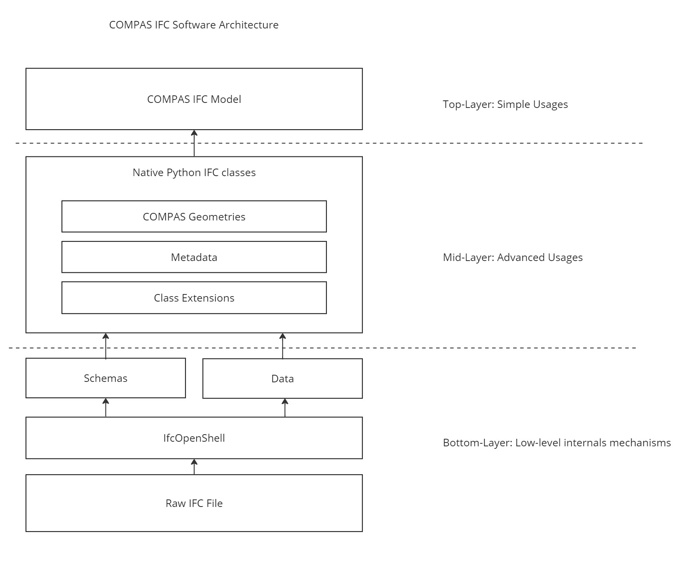

********************************************************************************
Software Architecture
********************************************************************************

In a nutshell, COMPAS IFC is built around a three-layer structure, purposefully designed for different group of users concerned with different level of granularity of the IFC data.

- **Top-layer**: This layer provides simple usage interfaces for interacting with a BIM model. It abstracts the complexities of the IFC format, allowing non-experts to manipulate IFC data with ease.

- **Middle-layer**: This layer grants access to individual IFC entities and their properties. It is designed for advanced users who need to work with the geometry and metadata of IFC entities at a more granular level.

- **Bottom-layer**: This layer deals with the raw IFC data and schema processing. It concerns the most technical users such as contributors to the software itself regarding issues such as performance, memory usage, etc.

The architecture is designed to separate concerns, allowing users to choose the level of complexity they need, from simple model manipulations to detailed data handling.

   COMPAS IFC architecture

Top-layer
---------

The Top-layer of COMPAS IFC centers on the `Model` class, providing a user-friendly interface for IFC data interaction. This class offers intuitive APIs for simplified BIM model manipulation.

**Key features of the `Model` class:**

1. **Simple file operations**: Load, save, and create IFC files effortlessly.
2. **Built-in visualization methods**: For easy model inspection.
3. **High-level querying**: For straightforward element retrieval and manipulation.
4. **Abstraction of IFC complexities**: Enabling effective BIM model work without deep IFC knowledge.

This approach lowers the entry barrier for IFC file handling, allowing users to focus on their tasks rather than underlying data structures. For more details on the `Model` class, see the `Tutorials <tutorials.html>`_ section.

Middle-layer
------------

The Middle-layer of COMPAS IFC provides a comprehensive suite of native Python classes for interacting with individual IFC entities and their properties. These classes are automatically generated from the official IFC schemas, ensuring a complete and up-to-date mapping of IFC classes and types.

**Key features of the Middle-layer include:**

1. **Strongly typed classes**: Each class is strongly typed, enabling modern IDEs (such as those using Pylance) to provide extensive type hints and analysis. This enhances the development experience by improving code completion, reducing development time, and minimizing the need for constant documentation lookups.

2. **Robust extension mechanism**: COMPAS IFC includes a powerful extension mechanism that allows for the enhancement of key classes to simplify their usage and empowers users to create custom extensions for tailored functionality. For instance:

   - The ``IfcProduct`` class is extended with a ``geometry`` property that parses complex IFC geometric representations into COMPAS-based geometry.
   - The ``IfcElement`` class is augmented with ``parent`` and ``children`` properties, simplifying navigation of the IFC spatial hierarchy.

These features provide a powerful and flexible interface for working with IFC data at a granular level, suitable for advanced users who require detailed control over IFC entities and their properties.

For more information on the extension mechanism, please refer to the `API: extensions <architecture.html>`_ section. For a comprehensive overview of the class mapping, see the `API Reference: Full class mapping <api.html>`_.

Bottom-layer
------------

Lastly, in the Bottom-layer, COMPAS IFC interacts with the IfcOpenShell library to parse and manage IFC data. This layer is primarily of interest to contributors and advanced users who needs to modify the lower-level functionalities for tasks such as performance optimization, memory usage reduction, etc.
