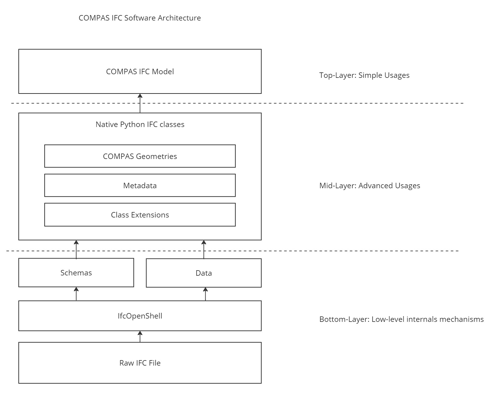

********************************************************************************
Architecture
********************************************************************************

COMPAS IFC is organised as a three-layer front-end / back-end structure that
separates *what users interact with* from *how IFC data is read, written, and
kept consistent*. The architecture is described in detail in chapter 4 of the
underlying thesis (*Data Model for Humans*); this page summarises it.

   The three layers of COMPAS IFC.

Top layer — front-end API
=========================

The user-facing API consists of four components:

:class:`~compas_ifc.bim.BuildingInformationModel`
   The orchestrator. Opens, queries, modifies, and saves IFC files. Holds
   project-level metadata (name, schema version, units) and exposes the
   spatial tree, the interaction graph, the element factory, the validation
   engine, and visualisation helpers.

:class:`~compas_ifc.element.GenericElement`
   A single element class that represents every IFC product subclass —
   ``IfcWall``, ``IfcSlab``, ``IfcSpace``, ``IfcSite``, ``IfcBuildingStorey``,
   and the rest. Distinguished by an ``ifc_type`` string that maps back to
   the appropriate IFC class on export. Custom strings without a matching IFC
   class fall back to ``IfcBuildingElementProxy`` while preserving the
   original type as ``ObjectType``.

Spatial tree (``model.tree``)
   An explicit tree built on COMPAS' ``Tree`` data structure. Each node has
   direct ``parent`` / ``children`` pointers and a placement matrix relative
   to its parent. Spatial-containment relationships in the IFC schema
   (``IfcRelContainedInSpatialStructure``, ``IfcRelAggregates``) are
   normalised into this tree on import; placement chains that don't align
   with the spatial parent are rectified automatically.

Interaction graph (``model.graph``)
   A bidirectional graph that captures the non-hierarchical relationships
   that don't fit the tree structure — structural connections, MEP system
   flows, material associations, geometric dependencies (openings, fills,
   space boundaries). Edges are labelled by category and group, so users can
   query ``model.connections``, ``model.space_boundaries``, or
   ``model.get_interactions_by_group("structural")``.

Bidirectional mapping layer
===========================

The middle layer keeps the front-end abstractions and the underlying IFC file
in sync. It is implementation detail — users do not need to interact with it
directly — but understanding it helps when reading the source code:

* **Relationship resolution.** Spatial-containment and decomposition
  relationships are converted to tree edges; structural, MEP, and geometric
  relationships are converted to graph edges. Round-tripping reverses the
  process: graph and tree edges are rewritten back into the appropriate
  ``IfcRel...`` instances on save.

* **Placement-chain rectification.** During import, each element's
  ``IfcLocalPlacement.PlacementRelTo`` is checked against its spatial
  parent. Misalignments — for instance an opening element placed relative
  to the storey instead of its host wall — are corrected so that the global
  position is preserved while the relative transform conforms to the
  hierarchy.

* **Representation conversion.** Each IFC geometric representation type is
  routed to the appropriate computational kernel: simple primitives and
  meshes use the COMPAS core library, swept solids and freeform B-Reps go
  through OpenCascade (via ``compas_occ``), and boolean operations dispatch
  to CGAL (``compas_cgal``) or OpenCascade as appropriate. The mapping is
  bidirectional: parametric definitions are preserved on round-trip rather
  than collapsing to tessellated meshes.

* **Type normalisation.** ``model.create_element(ifc_type=...)`` accepts
  ``"IfcWall"``, ``"Wall"``, ``"wall"``, or any custom string; the value is
  resolved against the active schema and either mapped to its canonical
  class name or stored as ``ObjectType`` on an ``IfcBuildingElementProxy``.

* **Property serialisation.** Pset definitions and IFC schema attributes are
  unified into ``element.properties`` for reading, and split back into the
  appropriate sinks (``Pset_*`` instances vs. direct entity attributes) on
  write.

Bottom layer — IFC schema interface
===================================

At the bottom, ``compas_ifc.file.IFCFile`` adapts
`IfcOpenShell <https://ifcopenshell.org/>`_ to the rest of the toolkit. It
handles low-level parsing and writing, schema dispatch (IFC2X3 / IFC4 /
IFC4X3), entity creation, and instance lookup. The
``compas_ifc.entities`` package provides Python wrappers that add convenience
methods (``geometry``, ``frame``, ``children``, ``property_sets``) to raw
``ifcopenshell`` entities; these wrappers are an internal implementation
detail of the mapping layer.

Geometry kernels
================

Three computational kernels combine to cover the full IFC geometry spectrum
without degradation:

============================= ============================ =====================
IFC representation             COMPAS class                 Kernel
============================= ============================ =====================
``IfcBlock``, ``IfcSphere``,   ``Box``, ``Sphere``,         COMPAS core
``IfcCylinder``                ``Cylinder``
``IfcExtrudedAreaSolid``,      ``Extrusion``                OpenCascade
``IfcRevolvedAreaSolid``
``IfcBooleanResult``,          ``Brep`` or ``Mesh``         CGAL / OpenCascade
``IfcCsgSolid``
``IfcFacetedBrep``             ``Mesh``                     COMPAS core / CGAL
``IfcAdvancedBrep``            ``Brep``                     OpenCascade
``IfcTriangulatedFaceSet``,    ``Mesh``                     COMPAS core
``IfcPolygonalFaceSet``
``IfcBSplineSurface``,         ``NurbsSurface``,            OpenCascade
``IfcRationalBSplineCurve``    ``NurbsCurve``
============================= ============================ =====================

The user-facing API is uniform across kernels: ``element.volume``,
``element.surface_area``, ``element.geometry.bounding_box`` work identically
regardless of the underlying representation type.

Validation engine
=================

Custom property requirements are expressed as
`Pydantic <https://docs.pydantic.dev/>`_ schemas. A
:class:`~compas_ifc.validation.Specification` ties a schema to the IFC types
it applies to. Specifications can be:

* attached to ``model.specifications`` for *enforcement* — validation runs
  inside ``add_element``/``create_element`` and rejects non-conforming
  insertions immediately; or
* passed to ``model.validate(specs)`` for *advisory* checking, which returns
  per-element ``ValidationResult`` records without modifying the model.

Pydantic schemas are substantially more concise than the equivalent
``IDS`` (Information Delivery Specification) XML, and they export to JSON
Schema for consumption by external tools.

Further reading
===============

* The thesis chapter 4 (`Data Model for Humans`) describes the design
  principles, the cognitive-complexity target (≤ 100 user-facing API
  members), and the evaluation results in detail.
* The reproducible evaluation scripts are in ``thesis/appendix/A/`` of the
  source repository.
