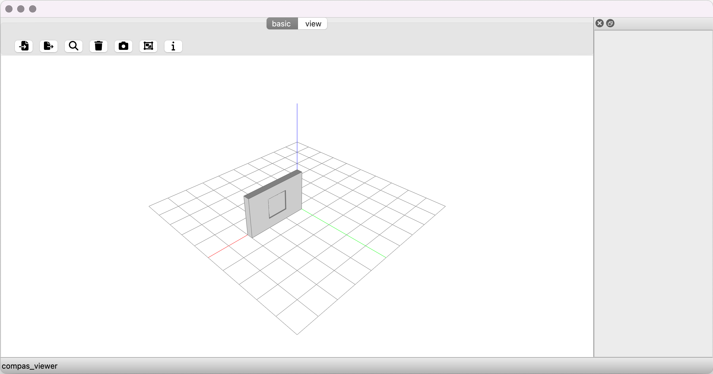

*******************************************************************************
3.1 Model View
*******************************************************************************

This example shows how to load an IFC file and display it in compas_view2.

.. code-block:: python

    from compas_viewer import Viewer
    from compas_ifc.model import Model

    model = Model("data/wall-with-opening-and-window.ifc")

    viewer = Viewer()

    for entity in model.get_entities_by_type("IfcBuildingElement"):
        print("Converting to brep:", entity)
        print(entity.body_with_opening)
        viewer.add(entity.body_with_opening, name=entity.name)

    viewer.show()

Example Output:

