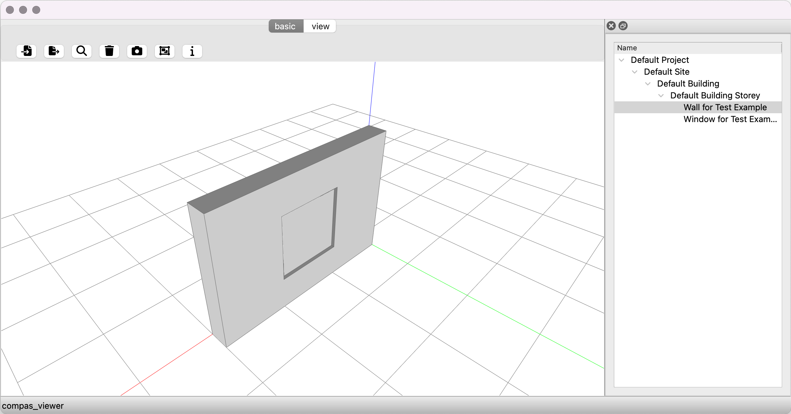

*******************************************************************************
5.0 IFC Viewer
*******************************************************************************

This example shows how to use the compas_viewer to visualise IFC files.

.. code-block:: python

    from compas_viewer import Viewer
    from compas_viewer.layout import Treeform
    from compas_ifc.model import Model
    from compas.datastructures import Tree, TreeNode

    model = Model("data/wall-with-opening-and-window.ifc")

    spatial_tree = Tree()
    root = TreeNode(name="root")
    spatial_tree.add(root)

    def add_entity_to_tree(entity, parent_node):
        node = TreeNode(name=entity.name)
        parent_node.add(node)
        for child in entity.children:
            add_entity_to_tree(child, node)

    add_entity_to_tree(model.project, root)

    spatial_tree.print_hierarchy()

    viewer = Viewer()

    for entity in model.get_entities_by_type("IfcBuildingElement"):
        viewer.add(entity.body_with_opening, name=entity.name)

    viewer.layout.sidedock.add_element(Treeform(spatial_tree, {"Name": ".name"}))

    viewer.show()

Example Output:

