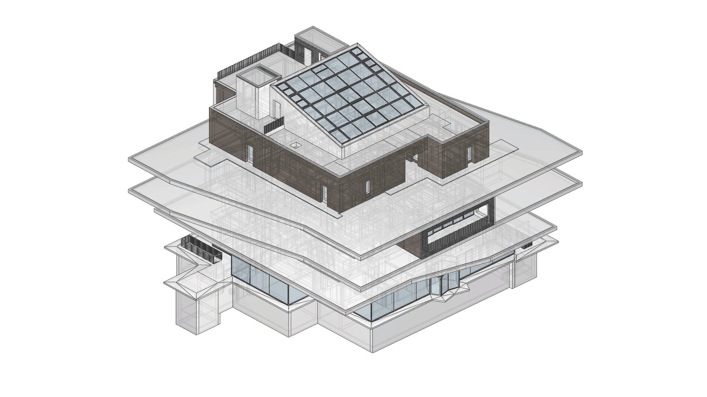

********************************************************************************
COMPAS IFC
********************************************************************************

.. rst-class:: lead

COMPAS IFC is a high-level python development tool for `Industry Foundation Classes (IFC) <https://www.buildingsmart.org/standards/bsi-standards/industry-foundation-classes/>`_, a major industry standard and digital format for data-exchange of Building Information Modelling (BIM) applications.

What for ?
==========

The primary goal of COMPAS IFC is to provide an accessible, transparent and user-friendly toolkit to interact with the highly intricate IFC format. 
So that developers and researchers can easily build custom computational workflows to read and write BIM data in IFC format intuitively with very small amounts of code.

Stands on giants' shoulder
==========================

As a core extension of `COMPAS framework <https://compas.dev/>`_, COMPAS IFC supports bi-directional translation from COMPAS data structures to corresponding IFC entities.
It benefits directly from the extensive range of tools that COMPAS ecosystem already provides, such as `COMPAS CGAL <https://github.com/compas-dev/compas_cgal>`_ and `COMPAS OCC <https://github.com/compas-dev/compas_occ>`_ for geometry processing, and `COMPAS Viewer <https://github.com/compas-dev/compas_viewer>`_ for visualization.
COMPAS IFC also heavily relies on `IfcOpenShell <https://github.com/IfcOpenShell/IfcOpenShell>`_, a fast, powerful and widely-used open source library as its "backend", for low-level functionalities like IFC file entities processing, geometry parsing, schema reading etc.
On top of this, COMPAS IFC additionally provides a large amount of useful APIs to greatly simplify common BIM data operations such as querying element info, inspecting project spatial hierarchy, reading and writing entities, geometry processing, visualization, exporting individual elements and creation of valid new IFC files from scratch.

.. note::
   For more information about the basic usage of COMPAS IFC, please refer to `Tutorials section <tutorials.html>`_.

Built for simplicity
====================

The biggest challenge to work with IFC stems from its sheer complexity. 
The latest `IFC 4.3 Specification <https://ifc43-docs.standards.buildingsmart.org/>`_ contains over two thousand object-oriented classes/type definitions accompanied with a large set of rules on how specific types of elements must relate to each other.
While tools including IfcOpenShell provides fully mapped APIs for each class/type definition, it can still be extremely difficult and cumbersome to build even simplest applications for IFC without significant expertise knowledge about the standard. 
Additional work must be done to bridge this gap.
To address this challenge, COMPAS IFC presents a lean and simplified data model as a “front-end” abstraction of the complicated IFC file content.
Users can interact intuitively with such a data model with minimal effort, while maintaining the integrity and validity of the raw IFC data behind.

.. note::
   For more information about the data model please refer to `Architecture: Simplified Data Model <architecture.html>`_.

Empower the advanced
====================

COMPAS IFC can also be a powerful tool for advanced users, who want to work at low-level directly with nitty-gritties of raw IFC entities.
Given an official schema, COMPAS IFC automatically generates a full mapping of IFC classes in native python, with all attributes and functions strongly typed.
This enables modern IDEs' language servers such as Pylance to provide extensive type-hints and analysis on all IFC classes and their attributes, which greatly improves the development experience, reduces development time and removes the need of constant lookup on documentations.
In addition, an extension mechanism is provided allowing advanced users customize existing IFC classes, and insert their custom modifications into the class inheritance chain.

.. note::
   For more information about the full python class mapping mechanism please refer to `Architecture: Full class mapping <architecture.html>`_.

Moving fast
===========

COMPAS IFC is developed for research and innovation, being used both in academia and innovative industry startups. It is currently under active development. If you have questions please do not hesitate create new issues on github repo or contanct us at li.chen@arch.ethz.ch or van.mele@arch.ethz.ch.

Table of Contents
=================

.. toctree::
   :maxdepth: 2
   :titlesonly:

   Introduction <self>
   Architecture <architecture>
   Installation <installation>
   Tutorials <tutorials>
   Examples <examples>
   API <api>
   license
