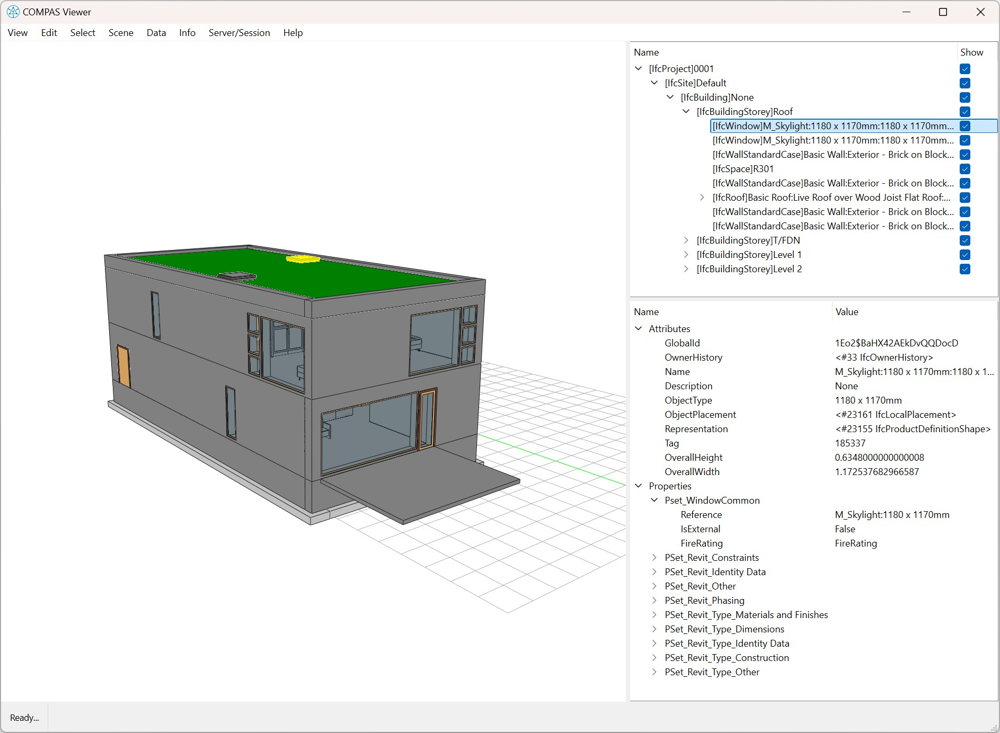

*******************************************************************************
Basics.5 Visualization
*******************************************************************************

This example shows how to load an IFC file and display it in compas_viewer.

.. code-block:: python

    from compas_ifc.model import Model

    model = Model("data/Duplex_A_20110907.ifc")
    model.show()

Example Output:

Alternatively, you can also display individual elements in the model.

.. code-block:: python

    from compas_ifc.model import Model

    model = Model("data/Duplex_A_20110907.ifc")
    model.get_entities_by_type("IfcWindow")[0].show()

.. image:: ../_images/element_view.jpg
    :width: 100%