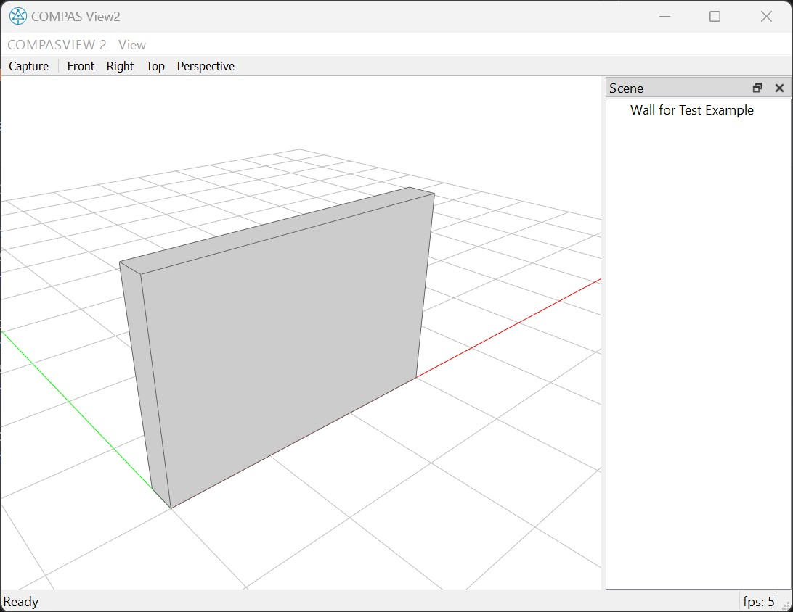

********************************************************************************
Basics - Entity APIs
********************************************************************************

.. rst-class:: lead
This tutorial shows how to use the Entity APIs to inspect and manipulate individual IFC entities.

We use a window element as an example.

::

    >>> from compas_ifc.model import Model
    >>> model = Model.from_ifc("data/Duplex_A_20110907.ifc")
    >>> window = model.get_entities_by_type("IfcWindow")[0]
    >>> window
    <#6426 IfcWindow "M_Fixed:4835mm x 2420mm:4835mm x 2420mm:145788">

Visualization
================================

Similar to the ``Model.show()`` function, you can use the ``Entity.show()`` function to visualize an individual entity.

::

    >>> window.show()

Entity Attributes
================================

Each entity in an IFC model has a set of attributes regulated by the `IFC standard <https://standards.buildingsmart.org/IFC/RELEASE/IFC4/ADD2_TC1/HTML/>`_,
such as general information like "Name", "Description", "Representation" and type specific information like "OverallHeight", "OverallWidth" for classes like ``IfcWindow``.

To access these attributes, you can use the ``attributes`` property.

::

    >>> window.attributes
    {'GlobalId': '1hOSvn6df7F8_7GcBWlR72', 'OwnerHistory': <#33 IfcOwnerHistory>, 'Name': 'M_Fixed:4835mm x 2420mm:4835mm x 2420mm:145788', 'Description': None, 'ObjectType': '4835mm x 2420mm', 'ObjectPlacement': <#6425 IfcLocalPlacement>, 'Representation': <#6420 IfcProductDefinitionShape>, 'Tag': '145788', 'OverallHeight': 2.419999999999998, 'OverallWidth': 4.834999999999996}

You can also directly access these attributes by calling them in ``CamelCase``, 
meanwhile the ``snake_case`` attributes are added by COMPAS IFC for simplified access to many aspects of IFC entity.

::
    
    >>> window.Name
    'M_Fixed:4835mm x 2420mm:4835mm x 2420mm:145788'
    >>> window.ObjectType
    '4835mm x 2420mm'
    >>> window.OverallHeight
    2.419999999999998
    >>> window.OverallWidth
    4.834999999999996

Spatial Hierarchy
================================

In IFC, entities are organized in a spatial hierarchy, meaning that each entity can have a parent and children.

For example an ``IfcWindow`` is a child of a ``IfcBuildingStorey`` and usually have no children.

::

    >>> window.parent
    <#39 IfcBuildingStorey "Level 1">

    >>> window.children
    []

The parent of an ``IfcBuildingStorey`` must be a ``IfcBuilding`` and can have many type of children, such as ``IfcSpace``, ``IfcWall``, ``IfcWindow``, etc.

::

    >>> building_storey = window.parent
    >>> building_storey.parent
    <#36 IfcBuilding "None">

    >>> building_storey.children
    [<#514 IfcSpace "A101">, <#4553 IfcWallStandardCase "Basic Wall:Interior - Partition (92mm Stud):139783">, <#6921 IfcWindow "M_Fixed:750mm x 2200mm:750mm x 2200mm:146885">, ...]

You can also use ``Entity.print_spatial_hierarchy()`` to print the spatial hierarchy of an entity in a tree view, with the current entity highlighted with ``**`` signs.

::

    >>> building_storey.print_spatial_hierarchy(max_depth=3)
    ================================================================================
    Spatial hierarchy of <#39 IfcBuildingStorey "Level 1">
    ================================================================================
    └── <#34 IfcProject "0001">
        └── <#38274 IfcSite "Default">
            └── <#36 IfcBuilding "None">
                ├── <#47 IfcBuildingStorey "T/FDN">
                ├── **<#39 IfcBuildingStorey "Level 1">**
                ├── <#43 IfcBuildingStorey "Level 2">
                └── <#51 IfcBuildingStorey "Roof">

Geometric Representation
================================

Entities that represents a physical product, need to be placed in a spatial context and have a geometric representation.
These two aspects are very complex when expressed in raw IFC classes, COMPAS IFC provides simplified access to these two aspects through the ``Entity.frame`` and ``Entity.geometry`` properties, 
which uses ``COMPAS`` data structures that are much easier to interact with.

::

    >>> window.frame
    Frame(point=Point(x=0.0, y=0.0, z=0.0), xaxis=Vector(x=1.0, y=0.0, z=0.0), yaxis=Vector(x=0.0, y=1.0, z=0.0))

::

    >>> window.geometry
    <compas_ifc.brep.tessellatedbrep.TessellatedBrep object at 0x0000022A8BED8640>
    >>> window.geometry.to_mesh()
    <Mesh with 56 vertices, 108 faces, 162 edges>

For more details about the ``Entity.frame`` and ``Entity.geometry`` properties, please refer to the :doc:`advanced.geometry` tutorial.

Custom Properties
================================

Most IFC entities are allowed to have custom properties or so-called ``Psets``, they can be accessed conveniently through the ``Entity.properties`` dictionary.

::

    >>> window.properties
    {'Pset_WindowCommon': {'Reference': 'M_Fixed:4835mm x 2420mm', 'IsExternal': True, 'FireRating': 'FireRating'}, ...}

Next Steps
================================

In the next tutorial, we will explore how to create an IFC model from scratch, including creating entities, setting up spatial hierarchy, and adding custom properties.

:doc:`intermediate.multi_story_building`

